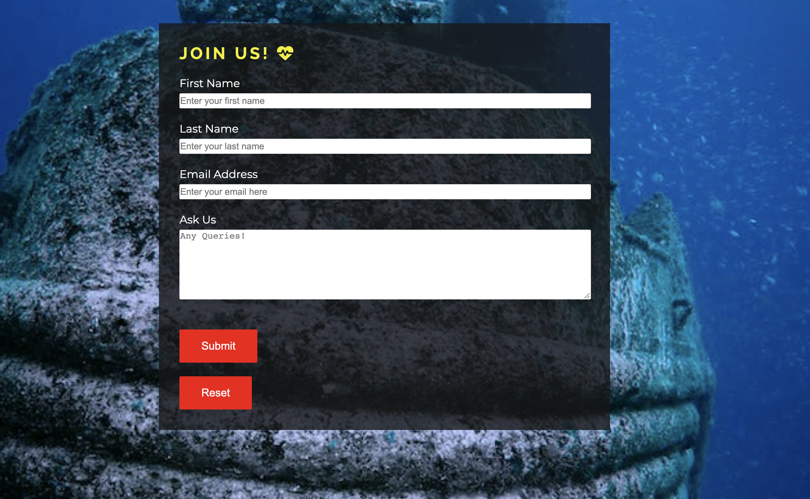

# Underwater_Exploration
## User Stories
- Scuba Diving Travel Plans
- Scuba Diving Courses
- Upcoming Events
- Social Media Links
- Able to use in different media 
- Where is this community located
## Site Owner Goals
- Website for diver community
- Explorers and travellers
- Extra activities we conduct
- User who are non-divers wanting to join this community
- Social media links attached
- Location and address is provided
- Images of activities provided
- About us
## Potential Features
- Navigation Bar
- Who are we?(About Us)
- Why dive with us?
- Photo Album(Gallery)
- How to communicate with us?(Join-us)
- Future Events
- Location
- Address
- Social media links
## Wireframes
A low-fi wireframe was build before developing the website. This was done in Balsamiq Wireframes. 

 The link for the wireframes for this site can be found [here](https://github.com/Sinha5714/Underwater_Explorer/blob/main/assets/screenshots/wireframes)

# Underwater Explorers
<p> The Underwater Explorers is a website for community of scuba divers who loves to travel around the world exploring various diving destinations</p>
<p>Users of this website will be able to find all the information they need to know about Underwater Explorers - About us, Why to dive with us, Our Address,Our location, Upcoming Travel Plans. They can also communicate with us regarding our plans or ask any queries they have. This site is targeted to all scuba divers who likes to travel around the world and also people who are interested in learning scuba diving </p>

[Link to the website](https://sinha5714.github.io/Underwater_Explorer/)


## Features

### Header:-

#### Navigation bar
<p> Featured at the top of the page. It shows community name on the left corner and navigation menu on the right       
      side.  
    Navigation menu consists 4 sections: Home Events Gallery Join-US which takes you to various pages of the website.
    The background of navigation bar is set to maintain the contrast so that the menu and title is easy to read.
    
  

#### Main-video and Main-text
  <p>In header itself a video of scuba diving is added which plays in a loop. 
  A main text is also added asking users to join and explore the diving world with the community.</p>


### Section- About US
- A small information about the commuity is added to inform users a little about what the community does and what is it all about.


### Section - Why Dive with US?
- This section gives the user basic information of what this community does and why the users should choose us.


### Footer
This section is at the bottom of the page. 
The Footer consists of our address, our location and the social media links.
The social media links helps the user to open our accounts in various social media platforms and follow us.


### Events 
On the navigation menu we have Events and it is clickable. User can click on the menu "Events" and can open the next page of the website.
In this page, user can find our upcoming travelling plans and decide to join us for the same.
This page also consists of navigation bar and footer same like as on main page.


### Gallery 
Next to Events in navigation menu, user can find gallery which is also clickable and takes the user to out photo gallery page.
The page consists of various pictures of our dive-trips and beach clean-ups. This page also consists of navigation bar and footer same like as on main page.


### Join Us
This page can be reached by clicking the Join Us section in the navigation bar. This is the last page of our website and it consists of a joining form. User can type there Name, Email, and can also ask any queries they have. This form once filled and submitted reach to us and we contact the user as soon as possible.



## Testing
I tested that this page works in different browsers- Chrome and Safari

### Lighthouse
The deployed website was also tested with Google Chrome's Lighhouse feature and all scores have been above 90 for both mobile and desktop.

#### For Desktop 


#### For Mobile 


### Validator Testing

#### HTML
No errors were returned when passing through the official [W3C validator](https://validator.w3.org/)

#### CSS
- No errors were found when passing through the official [(Jigsaw) validator](https://jigsaw.w3.org/css-validator/)

### Unfixed Bugs
- No unfixed bugs.

## Deployment

### Deploying the website to GitHub Pages:
The site was deployed to GitHub pages. The steps to deploy are as follows:
- In the GitHub repository, navigate to the Settings tab
- From the source section drop-down menu, select the Master Branch
- Once the master branch has been selected, the page will be automatically refreshed with a detailed ribbon display to indicate the successful deployment.

The live link can be found here - https://sinha5714.github.io/Underwater_Explorer/

### Cloning the repository
1. Visit the GitHub page of the website’s repository
2. Click the “Clone” button on top of the page
3. Click on “HTTPS”
4. Click on the copy button next to the link to copy it
5. Open your IDE
6. Type ```git clone <copied URL>``` into the terminal

## Credit

### Content
- The text content was provided by the site owner.
- The fonts of the content was taken from [google fonts](https://fonts.google.com/)
- The location is taken from [google maps](https://www.google.com/maps/)
- The icon has been taken from [fontawesome.com](https://fontawesome.com/v6/docs/) 

### Media
The video used in the site was taken from [pexels.com](https://www.pexels.com/)
The images in the website including gallery and background are taken from [pexels.com](https://www.pexels.com/)

### Code
#### The following code ideas were borrowed from [Love-running project](https://sinha5714.github.io/love-running/)

- Container for images in why-us section

- Social-media links in the footer section

- Join-us form

#### Code idea for video-player in header

- Code idea for video-player in header section was borrowed from Nas-Daily website".

#### Display : Flex 

- The attribute display with value: flex was learned using W3schools.

### Thank You
- to my mentor Can for supporting me with his feedback through the entire project
- to Code Institute and Slack community for helping me when I was getting stuck with some challenges.